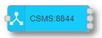

# node-red-contrib-ocpp2

[](https://nodei.co/npm/node-red-contrib-ocpp2/)

[Node-Red][4] nodes for communicating with Charge Systems (EVSEs) and Charge Station Central Managers via the [Open Charge Point 2.x Protocol][6] (hereafter OCPP). These node-red nodes
allow you to take on the role of a Central System (CS) or Charge Point (CP).

Based on the [OCPP 2.0.1][6] specifications utilizing the JavaScript Object Notation (hereafter JSON) protocols.


> **NOTE**:
>>These nodes are currently still at a **beta** release level.

This document assumes you are familiar Node-Red, javascript, and [OCPP 2.0.1][6]. 

> Note:
> Although it is assumed you have some knowledge of OCPP 2.0.1, don't get tripped up by some of the
> terminology / acronyms / changes in 2.0.1. In particular  
> OCPP 1.6: CS = Central System, CP = ChargePoint (or EVSE)  
> OCPP 2.x: CS = Charging Station (was CP), CSMS = Charge Station Management System (was CS)


# Requirements

The package currently requires

- [Node.js 16.20.0][1] or higher.
- [Node-Red 3.0][4] or higher.

# Installation

### Via Palette Manager in Node-Red

The easiest way to install the OCPP nodes in Node-Red is to install via its **palette manager**. Select the *Install* tab and search for `@anl-ioc/node-red-contrib-ocpp2`

### Via CLI / Terminal

In a terminal, go to the root directory of your Node-Red installation. In most cases this is either `~/.node-red` or `%userprofile%\.node-red`

From there, run the following command 

    npm install @anl-ioc/node-red-contrib-ocpp2


Once installed in Node-Red, you will find the 2 nodes in the node palette under the "OCPP" tab. If you had previously installed node-red-contrib-ocpp (the OCPP 1.6 version), then the new OCPP 2.0.1 nodes will be added to the same tab.
They have a slightly differnt shade of cyan as their color to make them stand out.  

*The OCPP 1.6 nodes are not required to make the 2.0.1 nodes work.*


# Nodes

- [CS node](#cs)
- [CSMS node](#cs-server)
- [Common features](#common)
- [examples](#examples)

---

## Common

Under the hood, both the CSMS and CS nodes share a lot of common functionality and features. This section explains some of those features in order to avoid duplicting explaination in the node specific sections. 

**User Generated Message IDs**

OCPP Request messages require they be identified by a unique ID. This allows for multiple Request messages to be sent/received prior to their Response being sent. Therefore, the Response message will contain the same unique ID that identifies the Request it is responding to. 

When generating a Request message to pass to the CSMS or CS node, the nodes will automatically generate a [UUID v4](http://www.ietf.org/rfc/rfc4122.txt) unique identifier and send it with the message. However, if you wish to override this feature and instead provide your own unique ID, you can do so by including a `MessageId` in your payload.

Since the auto-generated unique IDs are not available to the Request sender, this makes identifying some response messages easier for the flow designer. This feature is less important in the OCPP 2.0.1 nodes since it is now easy to get a direct callback for any Request messages sent.

Here is an eample payload that includes a (not so) unique ID.

```javascript
{
  "command": "Reset",
    "data" : { "type" : "Hard" },
    "MessageId": "12345678"
}
```

**Multiple Output Ports**

Both nodes have multiple output ports, each with their own unique purpose.



- The top port is the *common* output port. Is is used for outputing any incoming OCPP Requests and Responses, and non-ocpp specific messages to your flow. 
- The second port is the *link call* port. When an OCPP Request message is sent to the node input via a Node-Red `link call` node, the OCPP Response to that Request message will be directed out of this port. This port is intended to be linked to a Node-Red `link out` node that has the mode set to **return to calling link node**. This feature of the OCPP 2 nodes makes the asynchronous nature of OCPP more sychronous to the flow developer.
- The last port is the *ocpp log* port. If enabled in the nodes configuration, the node will output the raw OCPP messages it sends and receives through this port. This makes logging easier, and more flexible to the user since they can decide how to save, store, manage the data. *NOTE*: This node is dynamic and only shows if ocpp logging is enabled in the configuration. Any nodes attached to this port will "detach" if logging is turned off, but the attached nodes will remain on the flow.

**Custom Data**

OCPP Request messges sent to the node can now contain a special parameter called `customData`. When the Request message is sent, the `customData` paramter is stored and held onto internally until a matching Response is received. The Response message is output, including the stored `customData` paramter. The paramter can be anything you want; a string, number, boolean, or object. 

The `customData` parameter is not part of the `msg.payload`, but on the same level. Hence `msg.customData`

Example:
```javascript
msg = {
  "payload": {
  "command": "Reset",
    "data" : { "type" : "Hard" }
  },
  "customData": {
    "target": "OCTT1:TransactionEvent"
  }
}

```
A Response message given back to the flow would then contain the same `msg.customData` item with the same object. This allow a flow developer to provide hints/tags as to what to do next if a particular sequence of OCPP messages must be sent in partiular situations. They could make a decision by providing the *custom data* parameter to a switch node for example.


**Message Format**

Messages sent to either node have the same general format. Most infomation is sent in the `payload` section of the message.

 - OCPP Request Messages
```javascript
msg.payload = {
  "command": "Reset",  // an ocpp command. Do not do "ResetRequest"
  "msgType": 2,        // not needed for Request messages since it is default
  "data": { "type": "Hard" }, // include the message specific data here. an empty object may suffice for some messages
  "MessageId": "123-456-789" // optional since if absent will be auto-generated
}
```
Of course, these can become a bit more complex in real usage. For example, here is a Request message for a `notifyEvent` (aka `statusNotification` in OCPP 1.6)

```javascript
msg.payload = {
// OCPP 2.x way...
    "command": "NotifyEvent",
    "data": {
        "seqNo": 1,
        generatedAt: timestamp,
        eventData: [{
            "eventId": 1,
            timestamp,
            "trigger": "Delta",
            "actualValue": connectorStatus,
            eventNotificationType: "PreconfiguredMonitor",
            component: {
                name: "Connector",
                evse: {
                    id: 1,
                    connectorId: 1
                }
            },
            variable: {
                "name": "AvailabilityState"
            }

        }]
    }
```
- OCPP Response Messages 

```javascript
msg.payload = {
  "msgType": 3,        // required to identify this as a response to an existing request
  "data": { "status": "Accepted" }, // include the message specific data here. an empty object may suffice for some messages
}
```
- Received OCPP Messages

An OCPP message received from a connected CS or CSMS will contain additional information in the message that is given to the flow.

```javascript
{
  "ocpp":{
    "ocppVersion":"2.0.1",
    "MessageId":"0c33b406-2f6d-489b-ba61-cbbd452c8356",
    "command":"GetVariables",
    "cbId":"EVSE1"
  },
  "payload":{...},
  "topic":"EVSE1/Request",
  "_msgid":"2ebbed95dc1136d5"
 }
```
The `topic` will alway be set to the ChargeBoxID and message type. In the above example this message is a "Request" sent from a CS named "EVSE1". The cbId (ChargeBoxId) is also present in the `msg.ocpp.cbId` parameter.

**IMPORTANT**: When sending a Response message back to a Request, always reuse the `msg` message without altering the `ocpp` portion of the message. This allow the node to know to repackage the message with the same MessageId. Except where noted otherwise, it is best to only alter the `payload` portion of a Resonse message.

> **ALSO NOTE**:
> Message responses have an expiration timeout. They must be sent within a certain amount of time of receiveing
> the Request message or the Response message will not be sent. 

- Node Command Messages

The thrid type of message you can pass into a CS or CSMS node is a *Command Message*. These messages are not OCPP messagges, and they do not pass between a connected CS and CSMS. Instead they are ways of controlling the OCPP nodes or dynamically setting internal paraamters of the flow at run time (as opposed to settings in the config)
```javascript

msg.payload = {
  "msgType": 4,        // required to identify this as a response to an existing request
  "command": "doSomething" // Refer the the CS or CSMS specific section on Command Messages
  "data": { "status": "Happy" }, // Command messages may or may not have associated data
}
```

For example, the CS node lets the flow developer await connection to a CSMS at flow startup and instead make the connection based on receiving a `connect` *Command message*. Refer to the example in the CS section.


## CS
This section talks specifically about the CS (Charge Station) node.
### Configuration

 - Name: Name shown on the node. Will default to the cbId if blank.
 - cbId: A unique ChargeBox ID name. Many CSMS require all CSs to have unique cbId, although some may base unique connection on network address or URL routes.
 - OCPP Logging: Enable / Disable output of raw OCPP messages by node. Shows/Hides 3rd output port accordingly
 - Target CSMS:
    - Url: Add/Select a configured CSMS for node to connect to.
 - Auto Connect: Enable/Disable if the node will attempt to connecto to the CSMS when the flow starts
 - Basic Auth:
    - Password: The password assigned to this CS in order to connect to the CSMS
- Retry Backoff
    - Min (sec): The minimum amount of time to wait before trying to reconnect to a CSMS
    - Times to inc: The number of times to each retry waits an additional "Min" seconds
    - Max Random Range: a random number of seconds to add to wait time. (from 0 to value)


- Name: The name that shows in the dropdown list that identifies this CSMS URL setup
- URL: The actual URL to the CSMS. Must be of either ws:// or wss:// type. URL includes any particular port number and route (for esample /ocpp). Do not include the CS cbid at the end of the route portion. That is automatically done by the node.

---
## CSMS


- Name: The name that is displayed on the flow node.
- Port: Must contain a port number that isn't being used on the same system Node-Red is running on (for example, can't be port 1880)
- Path: This is the route that the node awaits connections on. Although not useful here (yet), multiple routes/paths on the same port can be used to support multiple versions of OCPP.
- OCPP Logging: Enable / Disable output of raw OCPP messages by node. Shows/Hides 3rd output port accordingly
- Authentication List:
    - CS Auth: This is a JSON object of key/value pairs that represent basic authentication information the node uses to authenticate connections. 
        - The keys represent the username, which MUST be the same as the cbId (ChargeBoxId) of the authenticating CS.
        - The values represent the password for that CS.
        - These values are stored securely in Node-Red and not saved when exported
        - See Set/Get_Auth_List/CS for dynamically setting these
---

## Examples

In the root of the OCPP2 node module folder is a folder named examples. This is where you can find example flows that may be useful in setting up your OCCP situation.

You can import the examples for these nodes (and other packages) via the Node-Red main **Import** menu. Use the *Examples* tab 


# Author

[Bryan Nystrom][11]  

[Argonne National Laboratory][10]  
.png>)


[1]: https://nodejs.org/
[4]: http://nodered.org
[6]: https://openchargealliance.org/protocols/open-charge-point-protocol/
[10]: https://www.anl.gov
[11]: https://github.com/bnystrom
